# 实名激活与连接机载电脑

!!! info "📖 本章导读"
    * 无人机首次使用前需要完成**实名认证与激活**，否则无法连接机载电脑
    * 激活成功后，本章介绍了三种连接机载电脑的方式（Type-C转网口线 / HDMI接显示屏 / 无线远程桌面），建议优先使用有线方式
    * 连接成功后，你将能在自己的电脑上操作无人机内部系统（Ubuntu）

## 实名认证与激活

#### 视频演示

  <video width="950" controls>
    <source src="https://diffrobots.oss-cn-hangzhou.aliyuncs.com/j30v2-wiki/video/authentication.mp4" type="video/mp4">
  </video>

!!! warning "⚠️ 注意"
    * 无人机在完成实名认证激活前，需要通过激活码获取权限，之后才能通过 SSH、显示屏、NoMachine 等方式连接

## 安装 NoMachine（远程桌面工具）

NoMachine 是一款跨平台的远程桌面工具，允许用户通过网络远程控制不同操作系统的计算机。无人机机载电脑中已经预装了 NoMachine，你只需要在自己电脑上安装即可。

> 💡 **提示**：无论使用哪种连接方式（有线/无线），最终都是通过 NoMachine 远程桌面来操作机载电脑。**机载电脑的用户名与密码均为 `nv`。**

两种获取方式任选其一：
1. 前往 [NoMachine 官网](https://www.nomachine.com/) 下载
2. 直接下载 Windows 版安装包：[nomachine_9.1.24 安装包（Windows）](https://diffrobots.oss-cn-hangzhou.aliyuncs.com/j30v2-wiki/materials/nomachine_9.1.24_6_x64.exe)

## 连接机载电脑

### 方式一：Type-C 转网口线（有线连接，最推荐）

> 💡 **推荐**：本机已随附配置 Type-C 转网口线束，并调整好了连接程序，无需外接显示屏即可直接连接，体验最佳。

视频教程：

  <video width="950" controls>
    <source src="https://diffrobots.oss-cn-hangzhou.aliyuncs.com/j30v2-wiki/video/remote_connection1.mp4" type="video/mp4">
  </video>

1. 无人机上电后，取出随附的 type-C 转网口线，将 type-C 端插到无人机 type-C 口，网口端插到自己的笔记本电脑的网口。

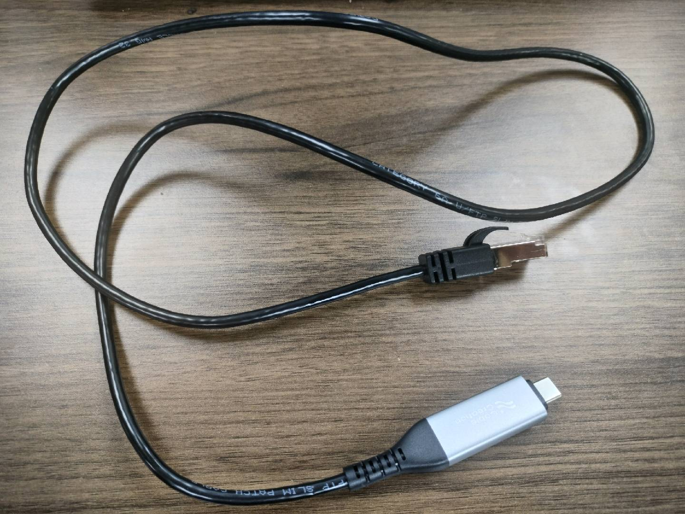

2. 在自己的笔记本电脑上按下 `Win+R` 打开"运行"对话框，输入 `control` 打开控制面板，点击"查看网络状态和任务"。

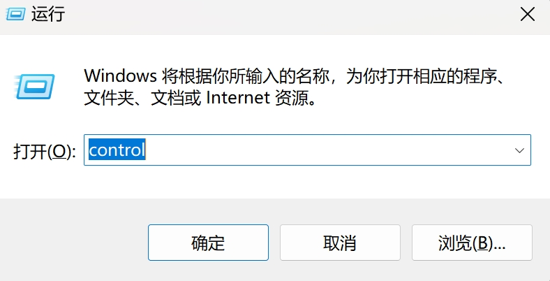
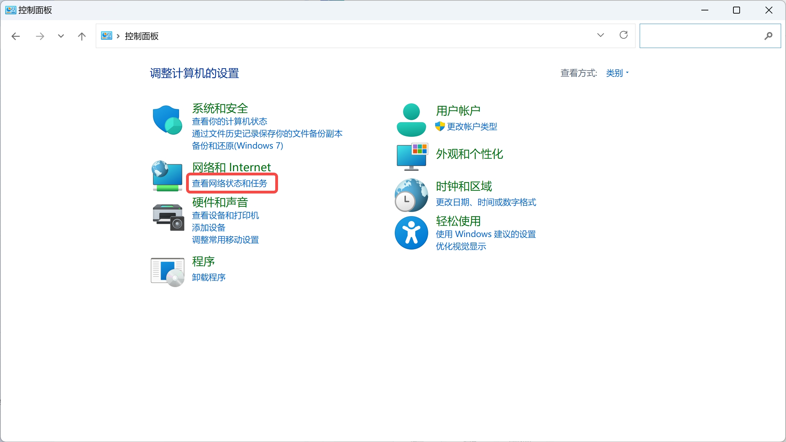

3. 点击"以太网"。

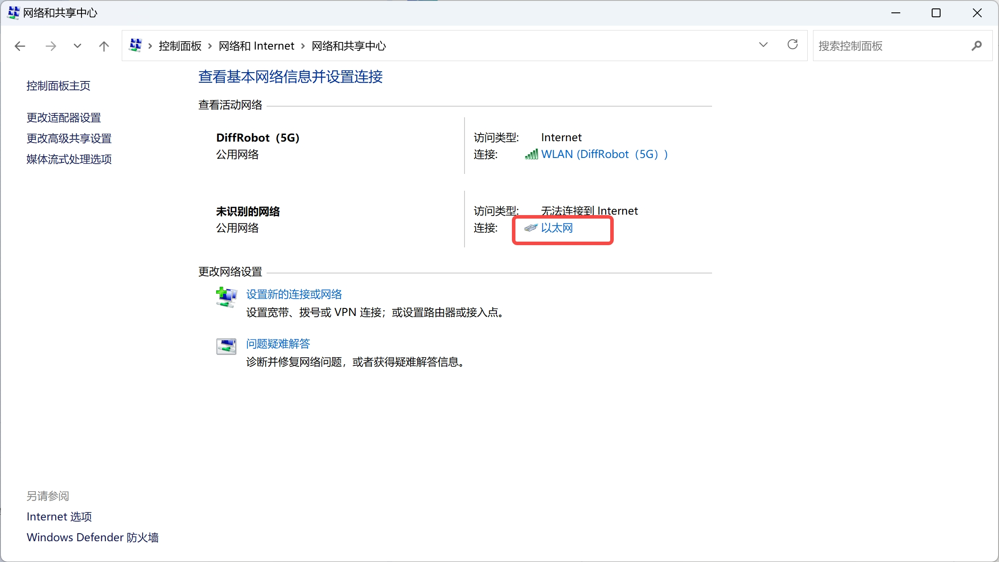

4. 点击"属性"。

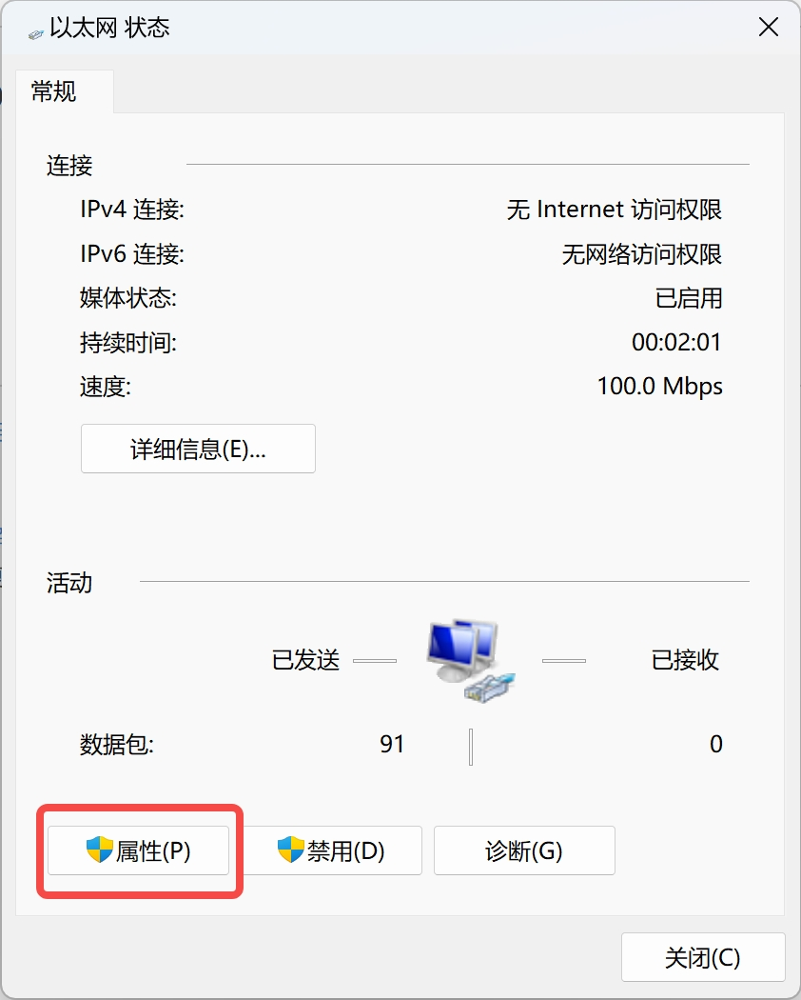

5. 双击"Internet 协议版本4（TCP/IPv4）"，选择"使用下面的IP地址"，IP地址处填入 `192.168.10.102`，子网掩码处填入 `255.255.255.0`，然后点击"确定"。

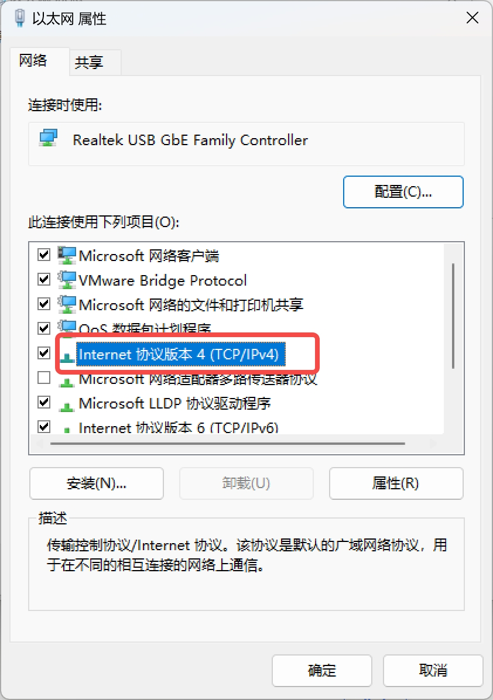
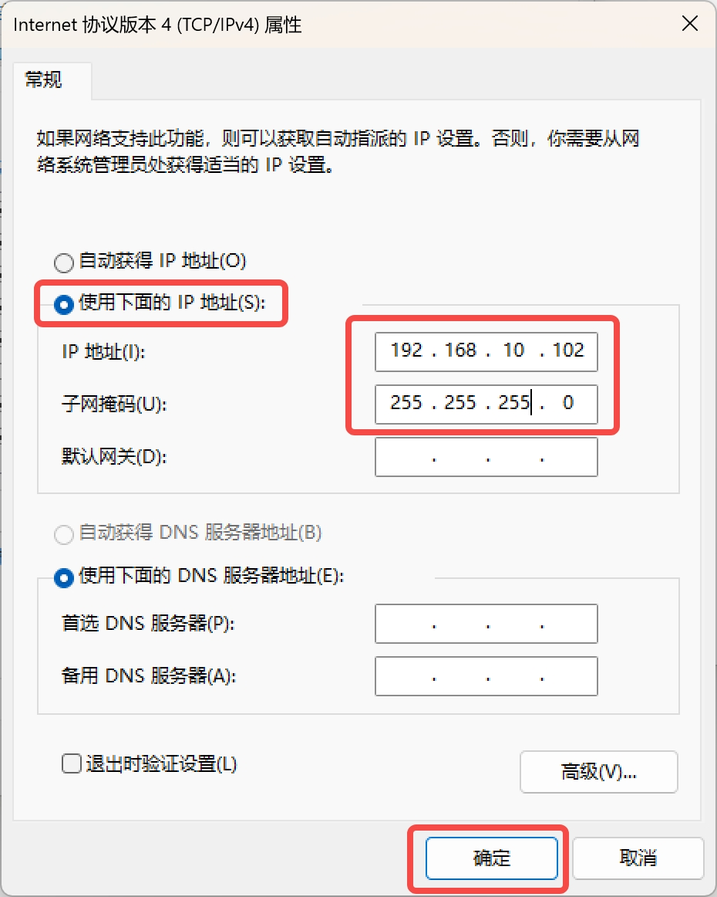

6. 点击"确定"。

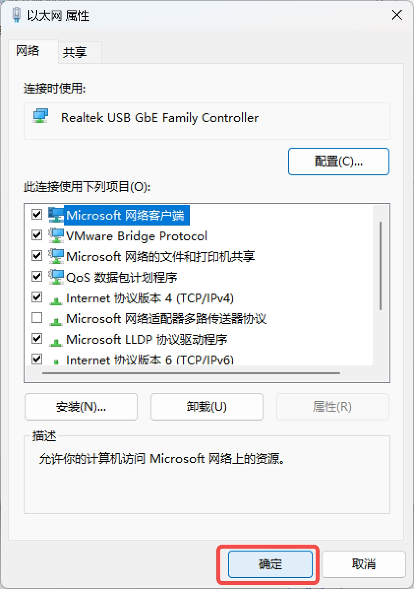

7. 打开 NoMachine，输入无人机 IP `192.168.10.100`，然后点击左上角的 `<Connect to new host 192.168.10.100>` 建立连接。

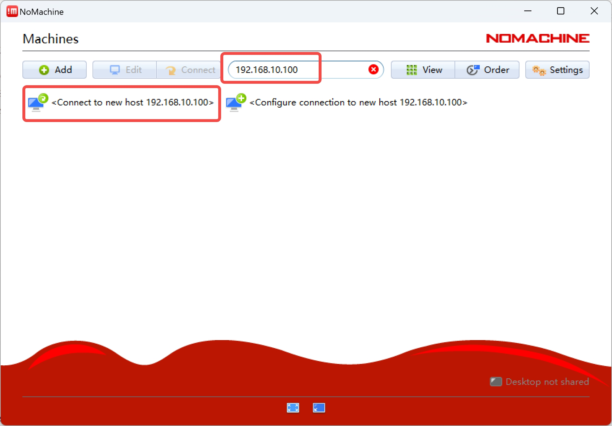

8. 输入用户名和密码，用户名与密码均为 `nv`，勾选保存密码选项，点击"ok"建立连接。

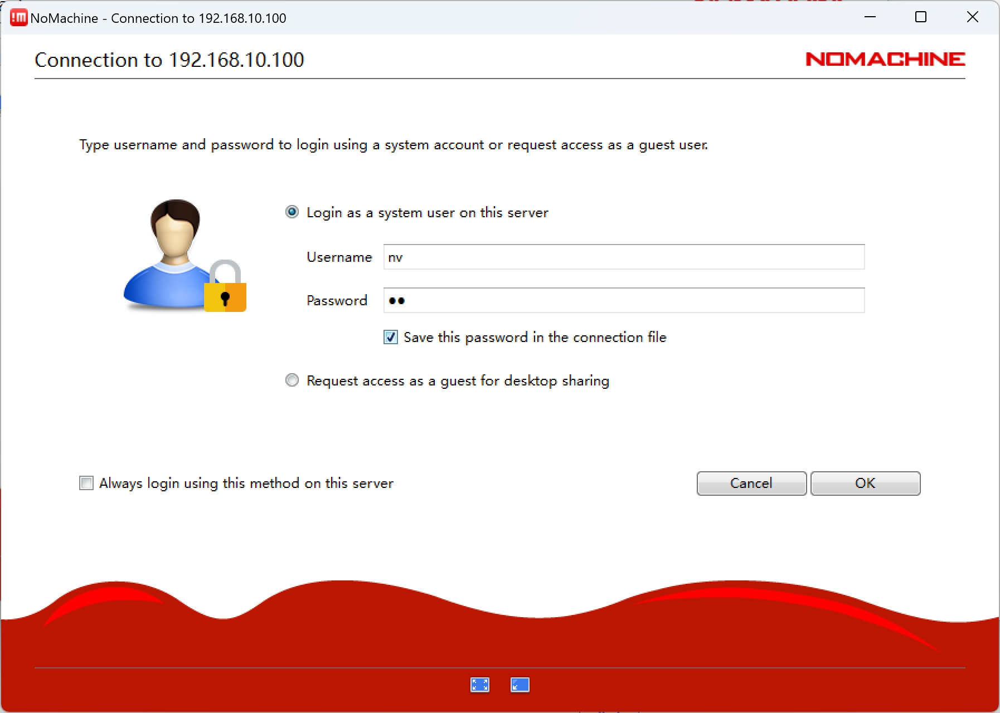

9. 成功进入无人机 ubuntu 系统界面。

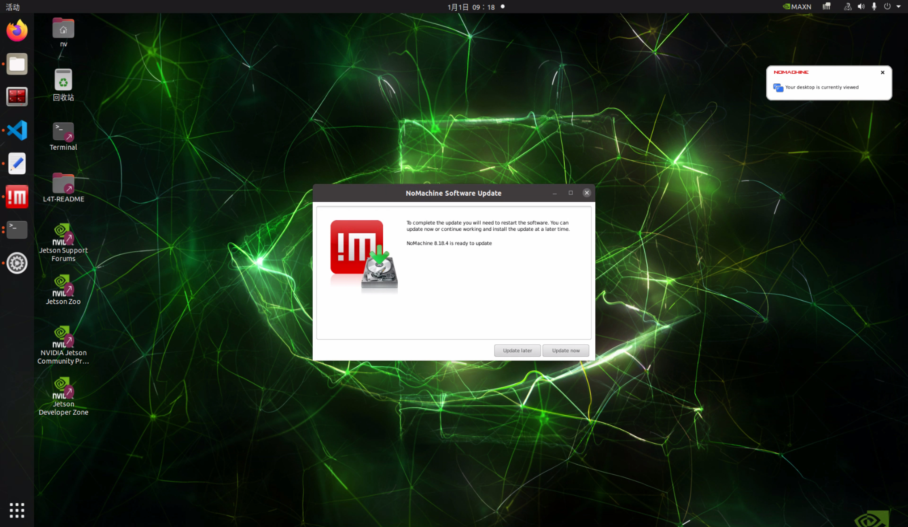

### 方式二：HDMI 外接显示屏（有线连接，传统方式）

传统方式，需要额外准备外接显示屏，体验较差，仅在无法使用方式一时采用。

视频教程：

  <video width="950" controls>
    <source src="https://diffrobots.oss-cn-hangzhou.aliyuncs.com/j30v2-wiki/video/remote_connection.mp4" type="video/mp4">
  </video>

1. 无人机上电后，准备好一根 HDMI 线，将 HDMI 线一端连接无人机的 HDMI 口，另一端连接显示屏的 HDMI 口。
2. 将 type-C 拓展坞插到无人机的 type-C 口，在拓展坞上插入键盘和鼠标。
3. 待机载电脑开机后，显示屏可以显示无人机 ubuntu 系统界面。

!!! warning "⚠️ 注意"
    * 若连接显示屏后没有反应，请按顺序排查：① 是否上电；② 是否配过热点连接导致 NX 端有线 IP 变了；③ 是否接错线
    * 正确顺序是先连接显示屏，再给无人机上电

### 方式三：无线连接（需先完成方式一或方式二）

1. 先完成方式一或方式二进入机载电脑系统。
2. 将机载电脑连上路由器的 WiFi，并在终端输入 `ifconfig` 查看无人机 IP 地址。

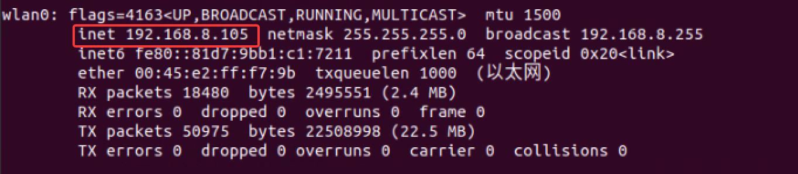

3. 建议固定无人机的 IP（需要与路由器的 WiFi 相同网段），方便后续连接，固定IP的方式可参考上文视频教程。
4. 将笔记本连上相同路由器的 WiFi。
5. 打开 NoMachine，输入无人机 IP，点击左上角的 `<Connect to new host 无人机ip>` 建立首次连接。
6. 根据指引连接机载电脑，用户名与密码均为 `nv`。

---

**下一步**：[首次手动飞行](首次手动飞行.md)——完成场地检查、解锁测试与第一次悬停飞行。
