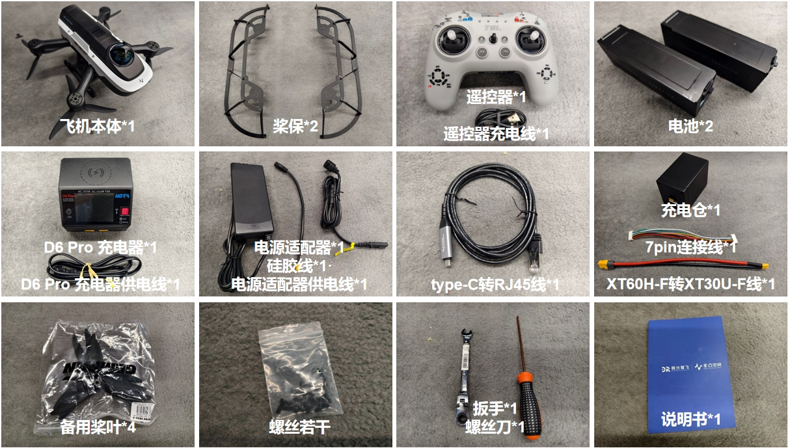

# 开箱与发货清单

!!! info "📖 本章导读"
    * 收到货后，先对照本章清单核对配件是否齐全
    * 观看开箱视频，了解无人机各部件的安装位置
    * 首次使用前请先阅读[安全须知与飞行前检查](../6-维护与支持/安全须知与飞行前检查.md)

## 开箱视频

  <video width="950" controls>
    <source src="https://diffrobots.oss-cn-hangzhou.aliyuncs.com/j30v2-wiki/video/unboxing.mp4" type="video/mp4">
  </video>

## 标准版发货清单

| 设备名称 | 数量 | 单位 |
| --- | --- | --- |
| 标准包装箱 | 1 | 个 |
| 非凸α无人机 | 1 | 架 |
| 桨保 | 1 | 套 |
| 遥控器 | 1 | 个 |
| 遥控器充电线 | 1 | 根 |
| 电池 | 2 | 个 |
| D6 Pro 充电器 | 1 | 个 |
| D6 Pro 充电器供电线 | 1 | 根 |
| 电源适配器 | 1 | 个 |
| 硅胶线 | 1 | 根 |
| 电源适配器供电线 | 1 | 根 |
| type-C转RJ45线 | 1 | 根 |
| 充电仓 | 1 | 个 |
| 7pin连接线 | 1 | 根 |
| XT60H-F转XT30U-F线 | 1 | 根 |
| 备用桨叶 | 4 | 个 |
| 螺丝 | 若干 | - |
| 扳手（用于更换桨叶） | 1 | 把 |
| 螺丝刀（用于安装桨保） | 1 | 把 |
| 说明书 | 1 | 本 |
| 合格证 | 1 | 本 |
| 验收单 | 1 | 份 |

## 选配包清单

根据你购买的版本，可能包含以下选配包：

### 集群选配包

| 设备名称 | 规格 | 单位 |
| --- | --- | --- |
| 标准版*N | N不大于5，一般为3或5 | 个 |

### 视觉追踪选配包

| 设备名称 | 规格 | 单位 |
| --- | --- | --- |
| 通用支架A | 1 | 个 |
| 单目摄像头 | 1 | 个 |
| 二维码（电子版本） | 1 | 张 |

### 视觉定位选配包

| 设备名称 | 规格 | 单位 |
| --- | --- | --- |
| 通用支架A | 1 | 个 |
| D435 | 1 | 个 |
| type-C to type-C 线 | 1 | 根 |

### 无人机耗材包

| 设备名称 | 规格 | 单位 |
| --- | --- | --- |
| 配件包装箱 | 1 | 个 |
| 电池组 | 2 | 个 |
| 充电电池仓 | 1 | 个 |
| 备用桨叶 | 2 | 套 |
| 普通桨保 | 1 | 套 |
| 外壳 | 1 | 套 |

### 裸机保护套装

| 设备名称 | 规格 | 单位 |
| --- | --- | --- |
| 通含碳纤维机身负载挂架 | 1 | 个 |
| 机头负载挂架 | 1 | 个 |
| 螺丝螺柱 | 若干 | - |
| 电池转接线 | 1 | 根 |

## 算法选配说明

| 版本 | 适配算法 | 需选配硬件 |
| --- | --- | --- |
| 标准版 | Diff-Navigation、Diff-YOPO | - |
| 集群版 | Diff-Navigation（集群） | 集群选配包 |
| 视觉追踪版 | elastic tracker、yolo、April Tag | 视觉追踪选配包 |
| 视觉定位版 | VINS | 视觉定位选配包 |

> **注**：集群版、视觉追踪版、视觉定位版可在标准版基础上任意组合选配。

## 桨叶更换与桨保安装

  <video width="950" controls>
    <source src="https://diffrobots.oss-cn-hangzhou.aliyuncs.com/j30v2-wiki/video/Blade_installation.mp4" type="video/mp4">
  </video>

!!! warning "⚠️ 注意"
    * **桨叶有正反面之分**：安装错误会导致无人机无法正常飞行甚至失控，**请严格对照视频教程安装桨叶。**
    * 更换桨叶前请确认无人机已断电、桨叶完全停止转动
    * 请使用包装内附带的扳手（用于更换桨叶）和螺丝刀（用于安装桨保）

---

**下一步**：[充电与遥控器](充电与遥控器.md)——了解遥控器按键并给电池充电。
