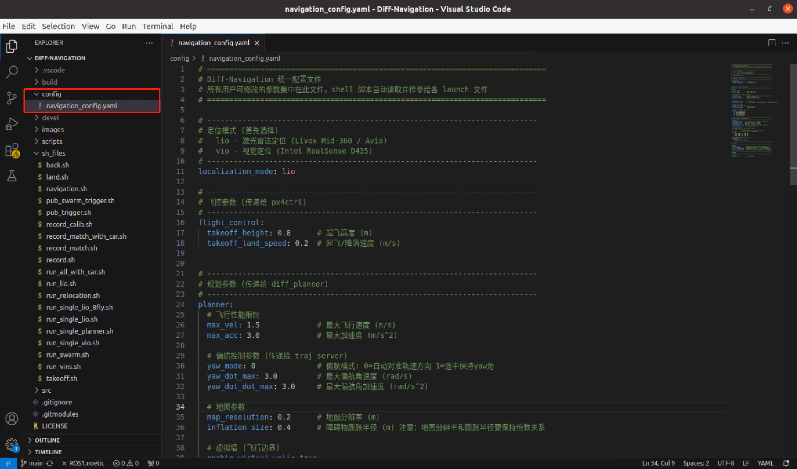
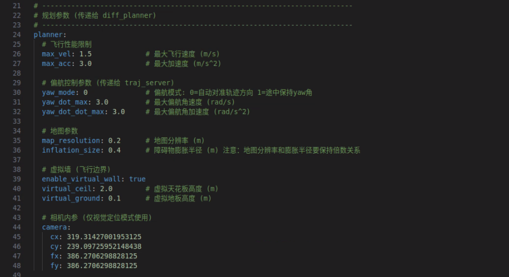
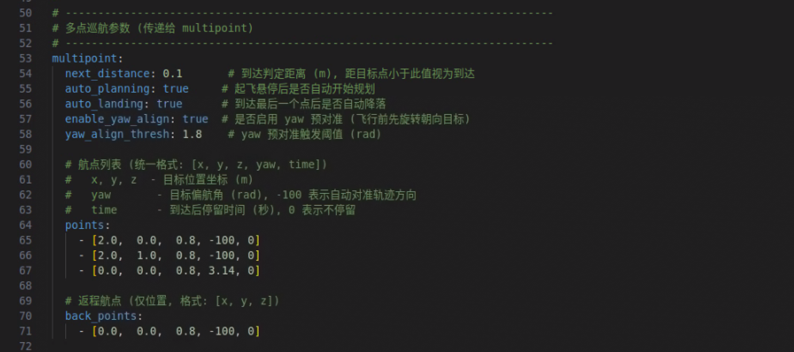
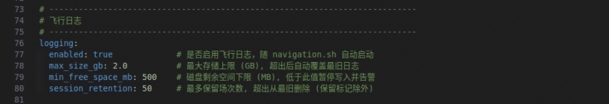
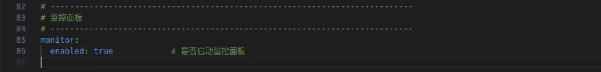
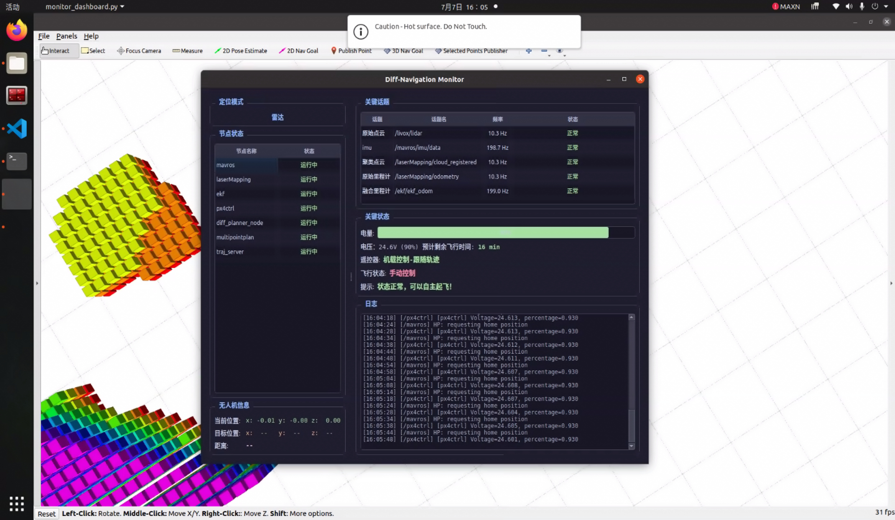

# 自主导航

!!! info "📖 本章导读"
    本章介绍如何让无人机**自主飞行到指定位置**。我们将按以下流程进行：

    1. **原理简介**：了解自主导航的完整流程
    2. **定位模式确认**：选择雷达定位（lio）或视觉定位（vio）
    3. **参数确认**：检查飞行前需要核对的关键参数
    4. **打点教程**：在 monitor 界面中标记目标点位置（文字版 + 视频）
    5. **自主导航飞行**：启动程序、执行任务（自动/手动两种方式）
    6. **规划出错时处理方式**：遇到异常时如何救机

!!! warning "⚠️ 注意"
    * 使用自主功能模块前请务必完成[自主飞行前准备](../1-快速上手/首次手动飞行.md)并确保飞手具备基本的手动操控能力
    * 在进行任何飞行操作前，请确保无人机已正确安装桨叶保护罩，飞行场地已设置安全防护网，并确保飞手具备充分的操控能力与应急处置能力
    * 不需要起飞的情况下请保持遥控器SC键在上锁模式，以免误触遥控器导致无人机自动起飞
    * 所有自主飞行功能在启动程序前都需要确保遥控器各通道档位与[遥控器介绍](../1-快速上手/充电与遥控器.md)中说明保持一致
    * 启动程序后若发现遥控器拨杆错误，请关闭程序重新调整遥控器档位，切勿临时调整后起飞，否则可能导致悬停油门估计异常
    * 为保证安全，自主飞行速度建议最高2.5m/s

## 原理简介

自主导航的全流程是这样的：

```text
① 打点：标记目标位置 → ② 填航点：把坐标写入配置文件 → ③ 启动程序
→ ④ 按 SD 键起飞 → ⑤ 无人机自主飞向各目标点 → ⑥ 到达后自动/手动降落
```

无人机在飞行过程中会实时感知周围障碍物，自动规划安全路径，不需要你遥控操作。

## 第一步：确认定位模式

定位方式决定了无人机"用什么眼睛看世界"。两种方式二选一，在配置文件 `Diff-Navigation/config/navigation_config.yaml` 中修改 `localization_mode` 参数：

| 参数 | 说明 |
| --- | --- |
| `lio` | 激光雷达定位（默认，适合大多数场景） |
| `vio` | 双目视觉定位（需选配双目相机 D435） |

> 💡 使用 `vio` 前，请先完成[视觉定位测试](定位测试/视觉定位.md)；使用 `lio` 前请先完成[雷达定位测试](定位测试/雷达定位.md)。

## 第二步：参数确认

在启动程序之前，请务必核对以下关键参数。相关配置项位于 `Diff-Navigation/config/navigation_config.yaml` 文件中。



### 1. 起飞高度与速度

检查起飞高度 `takeoff_height` 和起飞/降落速度 `takeoff_land_speed` 设置是否合适，**确保起飞高度内没有障碍物**。


| 参数名 | 默认值 | 说明 |
| --- | --- | --- |
| takeoff_height | 0.8 | 起飞高度 (m) |
| takeoff_land_speed | 0.2 | 起飞/降落速度 (m/s) |

### 2. 规划参数



| 参数名 | 默认值 | 说明 |
| --- | --- | --- |
| max_vel | 1.5 | 最大飞行速度 (m/s) |
| max_acc | 3.0 | 最大加速度 (m/s^2) |
| yaw_mode | 0 | 偏航模式：0 - 机头自动对准轨迹方向；1 - 保持固定yaw角 |
| yaw_dot_max | 3.0 | 最大偏航角速度 (rad/s) |
| yaw_dot_dot_max | 3.0 | 最大偏航角加速度 (rad/s^2) |
| map_resolution | 0.2 | 地图分辨率 (m) |
| inflation_size | 0.4 | 障碍物膨胀半径 (m)，**注意：地图分辨率和膨胀半径要保持倍数关系** |
| enable_virtual_wall | true | 开启虚拟墙（限制飞行高度范围） |
| virtual_ceil | 2.0 | 虚拟天花板高度 (m) |
| virtual_ground | 0.1 | 虚拟地板高度 (m) |
| camera | - | 相机内参（视觉定位时需检查） |

>**通俗解释**：
>* **虚拟墙**：给无人机画一个"安全的飞行盒子"——高度不能超过天花板、不能低于地板，防止撞到屋顶或误碰地面
>* **膨胀半径**：把障碍物"撑大"一圈，让无人机与障碍物保持安全距离，防止桨叶剐蹭

### 3. 多点巡航参数

* **自动执行任务**时的参数设置：
  * `auto_planning` 设为 `true`：无人机起飞并悬停后将自动开始执行航线规划。（注：该模式下仅会依次飞向 `points` 列表中的航点，不会飞向 `back_points` 中的返航点。）
  * `auto_landing` 设为 `true`：无人机到达最后一个目标点后将自动降落。
* **手动执行任务**时的参数设置：
  * `auto_planning` 设为 `false`：无人机起飞悬停后需手动按下遥控器 SD 键触发航线规划；执行完毕后，再次按下 SD 键方可触发返航至 `back_points` 点。
  * `auto_landing` 设为 `false`：到达最后一个目标点后需手动按下遥控器 SD 键，方可触发降落。



| 参数名 | 默认值 | 说明 |
| --- | --- | --- |
| next_distance | 0.1 | 到达判定距离 (m)，距目标点小于此值视为到达 |
| auto_planning | true | 起飞悬停后是否自动开始规划 |
| auto_landing | true | 到达最后一个点后是否自动降落 |
| enable_yaw_align | true | 是否启用 yaw 预对准（飞行前先旋转朝向目标） |
| yaw_align_thresh | 1.8 | yaw 预对准触发阈值 (rad) |
| points | - | 航点列表（统一格式: [x, y, z, yaw, time]）<br>x, y, z - 目标位置坐标 (m)<br>yaw - 目标偏航角 (rad)，-100 表示自动对准轨迹方向<br>time - 到达后停留时间 (秒)，0 表示不停留 |
| back_points | - | 返程航点（仅位置，格式: [x, y, z]） |

### 4. 飞行日志

检查是否启用飞行日志记录功能，`enabled` 应设置为 `true`（设为 true 则随 navigation.sh 自动启动）。



| 参数名 | 默认值 | 说明 |
| --- | --- | --- |
| enabled | true | 是否启用飞行日志 |
| max_size_gb | 2.0 | 最大存储上限 (GB)，超出后自动覆盖最旧日志 |
| min_free_space_mb | 500 | 磁盘剩余空间下限 (MB)，低于此值暂停写入并告警 |
| session_retention | 50 | 最多保留场次数，超出从最旧删除（保留标记除外） |

### 5. 监控面板

检查是否启动了监控面板功能，`enabled` 应设置为 `true`。



| 参数名 | 默认值 | 说明 |
| --- | --- | --- |
| enabled | true | 是否启动监控面板 |

## 第三步：打点教程

**打点的目的**：打点是为了更准确地获得自主导航时的 `points`，即航点列表——让你不用手动测量坐标，而是让无人机"自己走到那里"并记录下位置。

!!! warning "⚠️ 注意"
    - 所打点的 Z 值（高度）不得超出虚拟天花板和地板范围

**文字版步骤**：

1. 启动程序（见下方"自主导航飞行"第 1~3 步），等待约 50 秒程序完全启动，打开 monitor 界面。
2. 在 monitor 界面中进入打点模式（具体入口以 monitor 界面实际布局为准）。
3. 将无人机移动到第一个目标位置（可以手持无人机移动，或遥控器操控飞行到该位置）。
4. 确认位置后，在 monitor 界面记录该点为航点。界面中显示的坐标即为该点的 x、y、z 值。
5. 重复步骤 3~4，标记所有需要到达的目标点。
6. 打点完成后，将各航点坐标填入配置文件 `Diff-Navigation/config/navigation_config.yaml` 的 `points` 中，并手动设置 yaw 和 time。

**视频演示**：

<p>
  <video width="950" controls>
    <source src="https://diffrobots.oss-cn-hangzhou.aliyuncs.com/j30v2-wiki/video/dotting_monitor.mp4" type="video/mp4">
  </video>
</p>

## 第四步：自主导航飞行

1. 完成"打点"后，将目标点的坐标填入配置文件 `Diff-Navigation/config/navigation_config.yaml` 的 `points` 中的 x、y、z 的位置，并手动设置 yaw 和 time。

2. 将无人机放置于安全、平整地面，以无人机为中心半径50cm的四周请勿放置任何障碍物。打开遥控器，SC键切换成解锁模式，将左侧摇杆保持中位，右侧摇杆保持中位，将SB键切换到自主飞行模式（一档），SE键保持弹出状态。

3. 进入 `Diff-Navigation` 工作空间并启动脚本：

```bash
cd ~/Diff-Navigation
./sh_files/navigation.sh
```

!!! warning "⚠️ 注意"
    * 程序启动完成前，请勿移动无人机，否则会导致定位出错

4. 等待约 50 秒，程序完全启动后将自动打开 monitor 用户交互界面，并同时启动 RViz 可视化窗口。



5. **开始执行任务**，有两种方式：

    **方式一：自动执行任务**（`auto_planning=true`、`auto_landing=true`）

    按下SD键，此时无人机会自主起飞至设定高度，然后开始自动规划至目标点，依次到达目标点后，自动降落。待飞机安全着陆后，将遥控器的SC键改为上锁模式。

    自动执行任务视频演示：

    <p>
      <video width="950" controls>
        <source src="https://diffrobots.oss-cn-hangzhou.aliyuncs.com/j30v2-wiki/video/automatic_task_execution_monitor.mp4" type="video/mp4">
      </video>
    </p>

    **方式二：手动执行任务**（`auto_planning=false`、`auto_landing=false`）

    按下SD键，此时无人机会自主起飞至设定高度。**第二次**按下SD键，无人机开始依次自动规划至各个目标点。**第三次**按下SD键，无人机开始自动规划到返航点。**第四次**按下SD键，自动降落。待飞机安全着陆后，将遥控器的SC键改为上锁模式。

    手动执行任务视频演示：

    <p>
      <video width="950" controls>
        <source src="https://diffrobots.oss-cn-hangzhou.aliyuncs.com/j30v2-wiki/video/manual_task_execution_monitor.mp4" type="video/mp4">
      </video>
    </p>

## 规划出错时处理方式

视频演示：

<p>
  <video width="950" controls>
    <source src="https://diffrobots.oss-cn-hangzhou.aliyuncs.com/j30v2-wiki/video/Planning_error.mp4" type="video/mp4">
  </video>
</p>

!!! warning "⚠️ 自主飞行中出现意外的处理方式"
    * 无人机轨迹规划异常但定位正常：按下SE键使无人机进入悬停，操控至安全区域后下降油门降落，落地后将SC键切换到上锁模式
    * 无人机定位发散飞行失控但飞手有手控能力：将SB键从一档切换为二档或三档，即切换到光流模式手动接管飞机
    * 无人机定位发散飞行失控且飞手无手控能力：立即将SC键切换到上锁模式避免发生意外

> 💡 更完整的救机流程见[异常处置](../5-速查与排障/异常处置.md)。

---

**相关章节**：[异常处置](../5-速查与排障/异常处置.md) | [FAQ](../5-速查与排障/FAQ.md) | [指令速查手册](../5-速查与排障/指令速查手册.md)
