# 集群避障飞行

!!! info "📖 本章导读"
    本章介绍如何让**多架无人机在保持编队的同时实现避障飞行**。内容包括集群编号与网络配置、地面站终端分组控制、时间同步，以及集群程序的启动与监控。

> 💡 本章涉及多机 SSH、terminator 广播等高级终端操作，建议先熟悉 [ROS 与 Linux 基础操作](../4-二次开发/ROS与Linux基础操作.md)

> 💡 本章需要**集群选配包**（多台标准版无人机）。开始前请确保每台无人机均已单独完成[雷达定位测试](定位测试/雷达定位.md)。

!!! warning "⚠️ 注意"
    1. 将无人机按顺序编号，从 0 开始依次编号（如 3 架飞机分别为 0、1、2）
    2. 为每架飞机匹配对应的遥控器，并粘贴编号标签以便识别
    3. 逐一检查每架飞机的定位数据，确保定位准确无误

## 视频演示

<p>
  <video width="950" controls>
    <source src="https://diffrobots.oss-cn-hangzhou.aliyuncs.com/j30v2-wiki/video/swarm.mp4" type="video/mp4">
  </video>
</p>

## 操作步骤

### 1. 编号与摆放

将无人机从 0 开始顺序编号（如 3 架飞机编号为 0、1、2），并根据编号确认其位置偏移，偏移可参考下图：

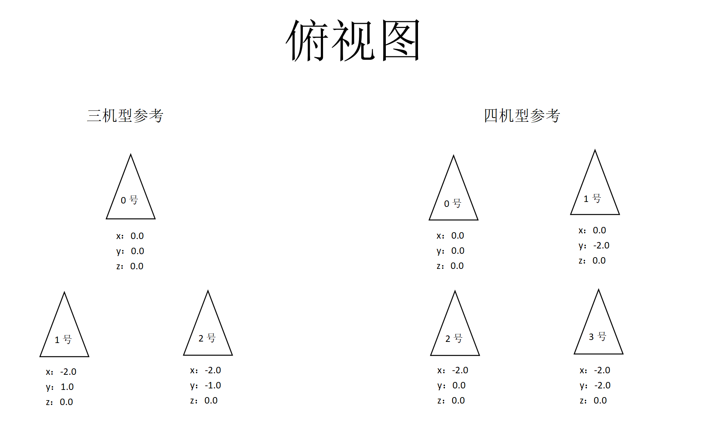

!!! info "💡 提示"
    * 具体摆放位置可根据实际场地与任务需求灵活调整

### 2. 网络配置

1. 将全部无人机与地面站（通常为你的笔记本电脑）连接至**同一网络**。
2. 采用手动配置 IP 地址的方式，分别为每架无人机和地面站指定固定 IP。
3. 每台无人机均需配置 `Diff-Navigation/sh_files/run_swarm.sh` 文件：

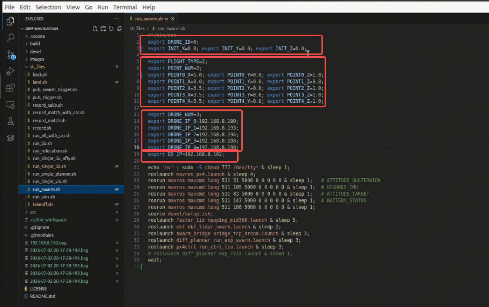

> 0号机

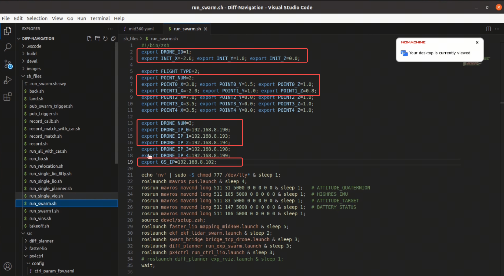

> 1号机

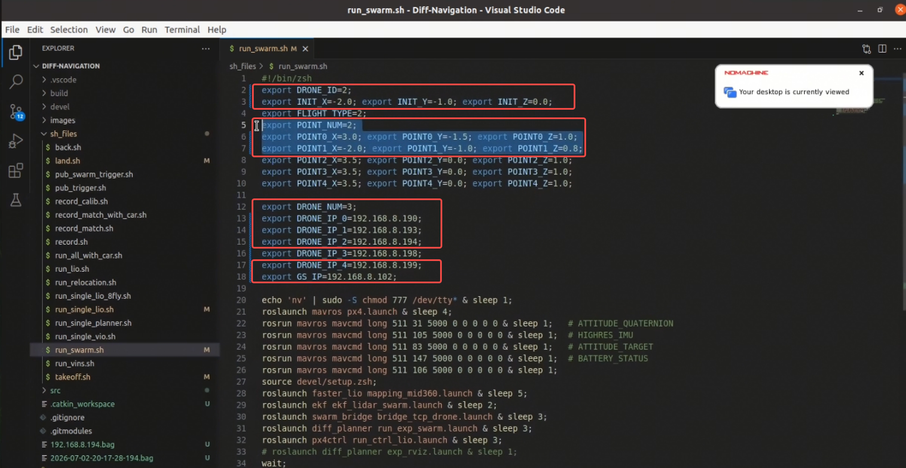

> 2号机

- `DRONE_ID`：无人机ID。0号机是 0，1号机是 1，2号机是 2
- `INIT_X、INIT_Y、INIT_Z`：该无人机的初始位置，每台无人机要根据自己的实际摆放位置修改
- `POINT_NUM`：目标点数量（根据实际飞行需求设置目标点数量）
- `POINT0_X、POINT0_Y、POINT0_Z`：第一个目标点坐标，每台无人机要根据自己的实际目标位置修改
- `POINT1_X、POINT1_Y、POINT1_Z`：第二个目标点坐标，每台无人机要根据自己的实际目标位置修改
- `DRONE_NUM`：无人机数量
- `DRONE_IP_0`：0号机IP
- `DRONE_IP_1`：1号机IP
- `GS_IP`：地面站IP（一般指自己笔记本）

### 3. 地面站准备

1. 在笔记本电脑虚拟机的用户主目录下新建 `Diff-Navigation` 文件夹，将无人机上 `Diff-Navigation` 中的 `src` 文件夹拷贝至虚拟机中对应的 `Diff-Navigation` 文件夹内，然后删除以下四个文件夹：`faster-lio`、`px4ctrl`、`utils`、`vins-fusion-gpu`。完成后进入 `Diff-Navigation` 目录执行编译：

```bash
cd ~/Diff-Navigation
catkin_make
```

2. 在自己笔记本的虚拟机中配置 `Diff-Navigation/src/diff_planner/src/swarm_bridge/launch/bridge_tcp_station.launch`：

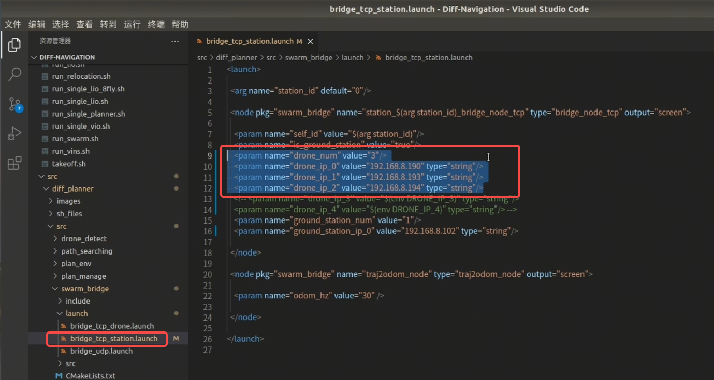

- `drone_num`：无人机数量
- `drone_ip_0`：0号机IP
- `drone_ip_1`：1号机IP
- `drone_ip_2`：2号机IP
- `groud_station_ip_0`：地面站IP

### 4. 地面站终端分组控制

1. **准备**：在地面站（一般为自己的笔记本电脑）的 ubuntu 系统下打开 terminator，将终端分为 3*3 个命令框。

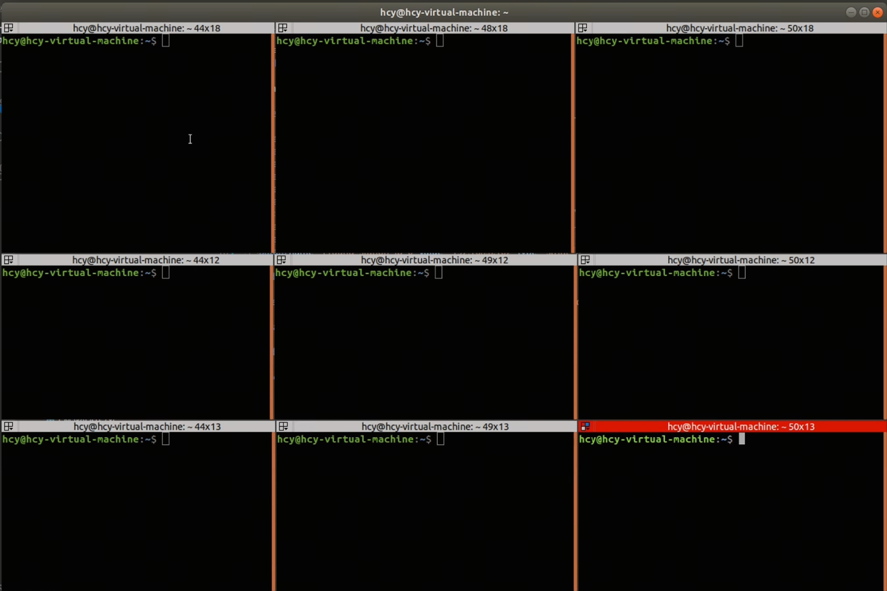

2. 使用 terminator **广播组**功能来分组控制无人机，先将每一列分为一组，3列总共3组；每一列都控制着一台无人机。

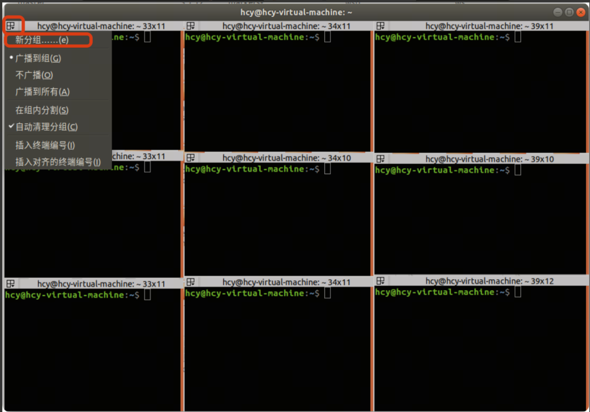
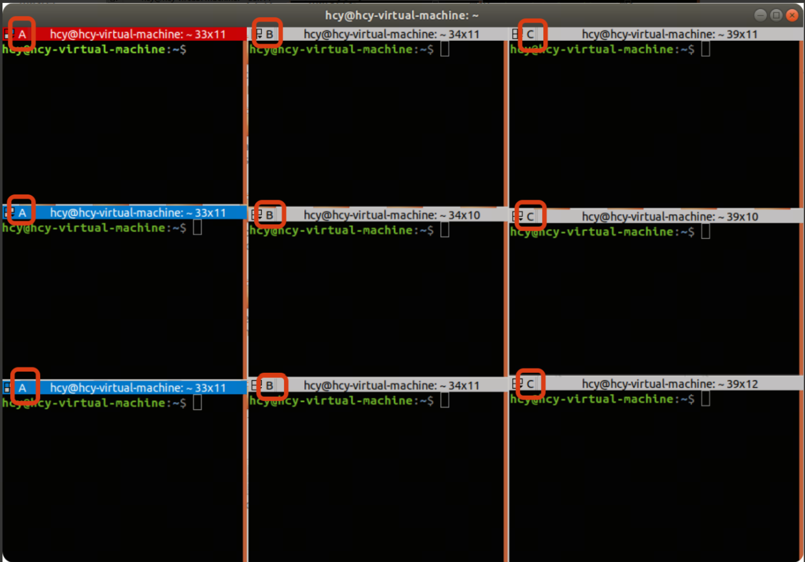

3. 使用 ssh 命令远程连接3台无人机：

```text
第一列（A）输入：ssh nv@192.168.8.190，回车进行连接，密码为：nv
第二列（B）输入：ssh nv@192.168.8.193，回车进行连接，密码为：nv
第二列（C）输入：ssh nv@192.168.8.194，回车进行连接，密码为：nv
```

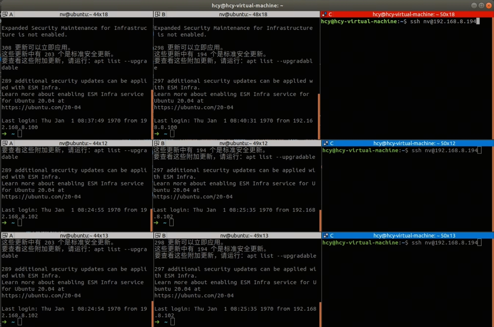

4. 每一列输入以下命令进入 `Diff-Navigation` 工作空间：

```bash
cd Diff-Navigation
```

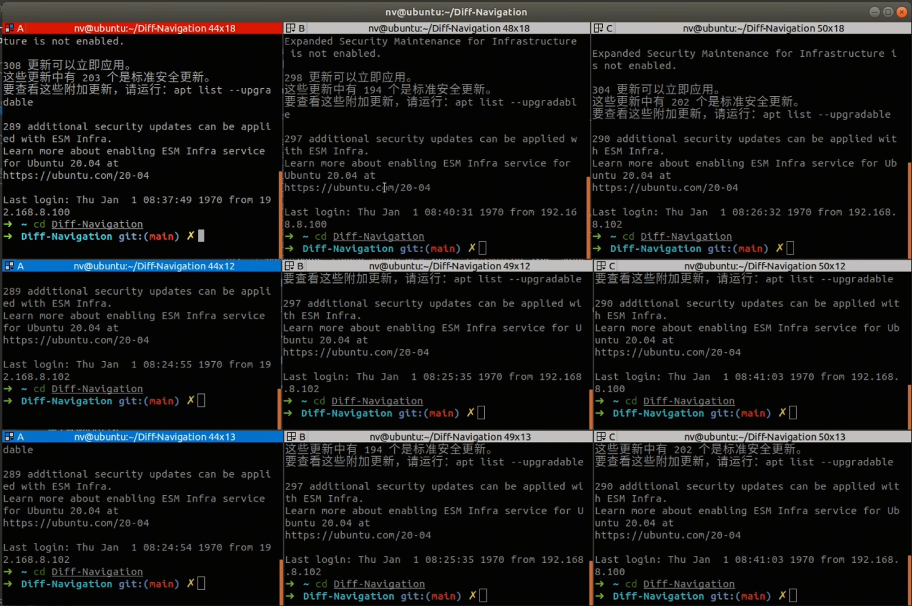

5. 修改分组情况，更改设置**每行为1组**，每列连接的都是同一架飞机，使用 terminator 广播组功能来分组控制无人机，具体的分配详见：

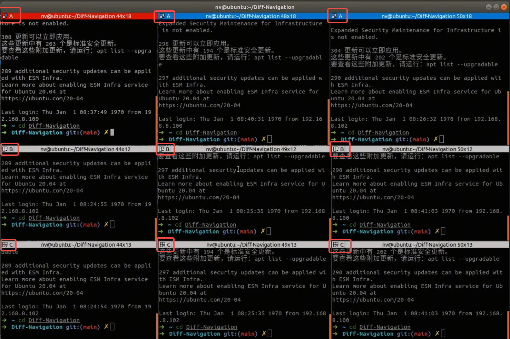

### 5. 时间同步

多架无人机协同飞行，时间必须一致（否则定位会互相错位）。请按以下顺序操作：

1. **打开地面站时间同步**：

```bash
systemctl enable ntp
systemctl start ntp
```

若地面站未安装ntp服务，可以使用 `sudo apt install ntp` 命令安装。

2. **打开无人机 ntp 服务**：在第一行命令框中输入命令：

```bash
sudo systemctl start ntp
```

3. **打开无人机时间同步**：在第一行命令框中输入命令，进行时间同步：

```bash
sudo ntpdate -u 192.168.8.102
```

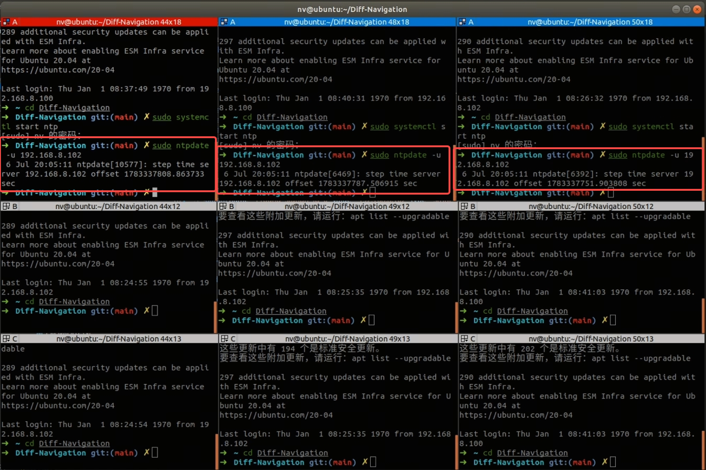

> 时间未同步

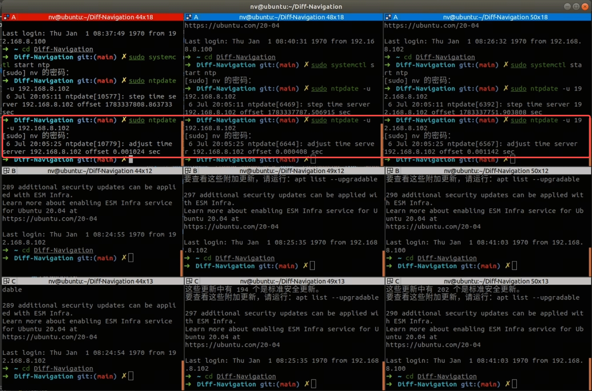

> 时间同步完成

!!! warning "⚠️ 注意"
    时间同步的单位为秒，尽量让所有飞机的时间同步的 offset 为毫秒级别（即 0.00x），有利于集群的稳定性，如果误差较大就多运行几次该脚本。

### 6. 启动集群程序与地面站监控

1. 在第一组命令框中输入以下命令，启动集群脚本，等待 30s 左右程序完全启动：

```bash
./sh_files/run_swarm.sh
```

2. 启动地面站监控。在笔记本虚拟机终端先进入 `Diff-Navigation`，打开 vscode，刷新一下工作空间，打开 rviz：

```bash
#开四个终端分别运行
cd Diff-Navigation
code .
source devel/setup.bash
roslaunch diff_planner exp_rviz.launch
```

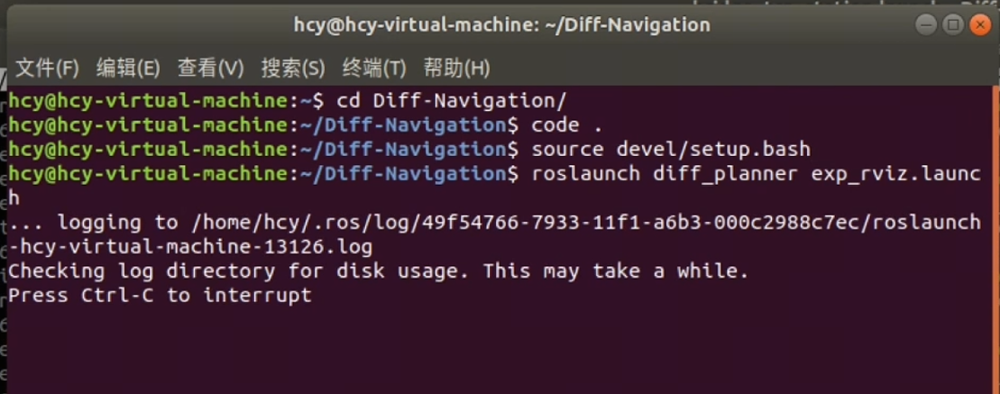

3. 打开新的标签页，先刷新工作空间，然后启动地面站，订阅三台无人机的位置信息：

```bash
source devel/setup.bash
roslaunch swarm_bridge bridge_tcp_station.launch
```

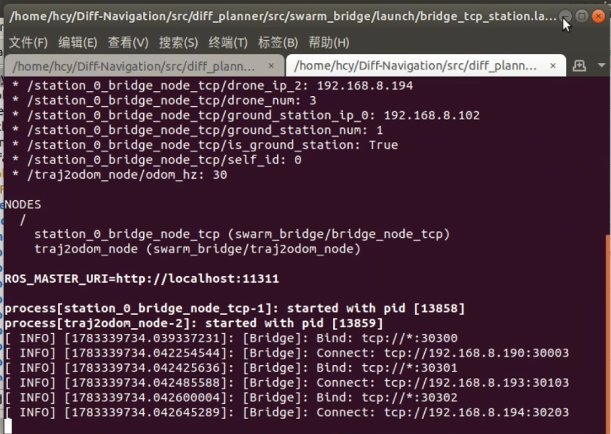

4. 在 rviz 中，选择 Odometry 话题为 `/others_odom`，即可观察到三台无人机位置信息：

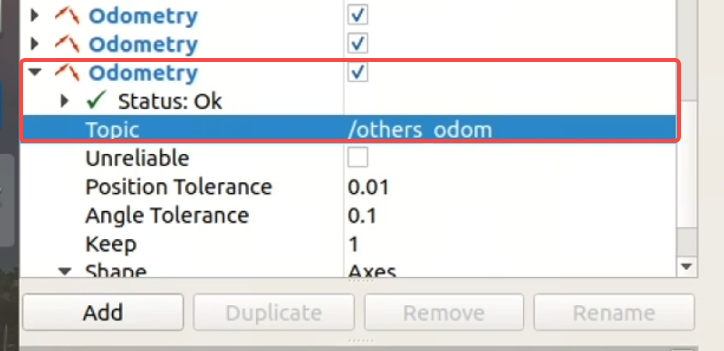
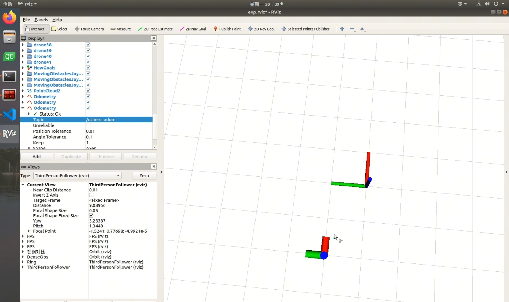

### 7. 起飞前准备

1. 在**第二组**命令框中输入起飞命令，但**先不执行**：

```bash
./sh_files/takeoff.sh
```

2. 在**第三组**命令框中输入降落命令，但**先不执行**：

```bash
./sh_files/land.sh
```

### 8. 开始执行任务

所有准备工作完成后，将手柄的 SC 键切换为解锁模式，然后**执行起飞命令**；当任务结束，**执行降落命令**；无人机落地后，将手柄的 SC 键拨至上锁模式。

---

**相关章节**：[雷达定位测试](定位测试/雷达定位.md) | [异常处置](../5-速查与排障/异常处置.md)
