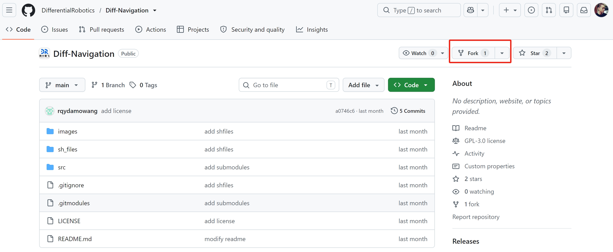
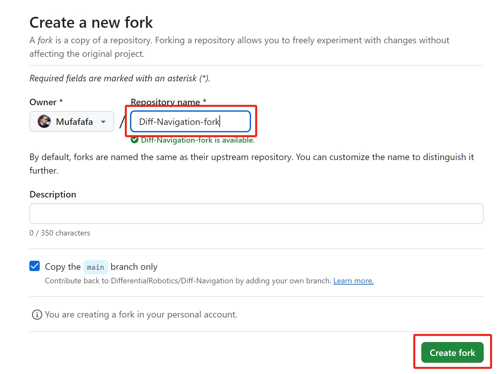
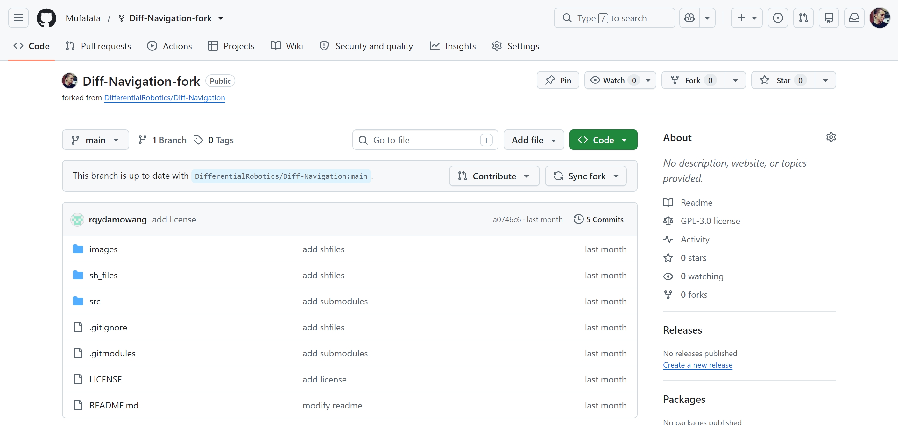

# 代码获取与维护

!!! info "📖 本章导读"
    本章帮助开发者基于本开源框架进行二次开发，内容包括：

    1. **官方代码拉取与编译**：获取完整代码并在无人机上编译
    2. **将官方代码合入私有仓库**：把代码迁移到你的团队私有仓库，保护代码资产
    3. **同步官方最新功能与修复**：在不覆盖自己修改的前提下，拉取官方更新

    此外，当误删或错误修改工作空间文件时，也可参照本章快速恢复环境。

* github仓库链接：[https://github.com/DifferentialRobotics/Diff-Navigation](https://github.com/DifferentialRobotics/Diff-Navigation)
* gitee仓库链接：[https://gitee.com/DifferentialRobotics/Diff-Navigation](https://gitee.com/DifferentialRobotics/Diff-Navigation)

!!! warning "⚠️ 注意"
    * 本仓库依赖了多个子模块（Submodules），在首次拉取代码时，请**务必**按照下方说明添加 `--recursive` 参数，否则会导致部分依赖包为空，从而引发 `catkin_make` 编译失败
    * 若使用 github 链接拉取代码时遇到网络问题，建议切换到 gitee 链接进行操作

## 官方代码拉取与编译

!!! info "💡 提示"
    * 若你不慎删除或错误修改了无人机 Diff-Navigation 工作空间下的文件，可直接删除原有的 Diff-Navigation 工作空间，然后重新拉取官方代码并进行编译，即可恢复干净的环境

请打开终端，执行以下命令拉取官方代码并完成编译：

```bash
# 1. 递归克隆仓库（完整拉取主仓库及所有子模块代码）
git clone --recursive https://gitee.com/DifferentialRobotics/Diff-Navigation.git

# 2. 进入工作空间目录
cd Diff-Navigation

# 3. 编译工作空间
catkin_make
```

## 将官方代码合入私有仓库（二次开发前期准备）

在实际项目中，你通常需要对代码进行大量的业务逻辑修改。为了保护代码资产，建议将其托管在公司内部或个人的私有 Git 仓库（如私有 GitHub、GitLab、Gitee 等）中。

请按照以下步骤将代码"转移"到你的私有仓库中：

1. **创建私有仓库**：在你的 Git 平台上创建一个全新的空仓库（不要勾选初始化 README 或 .gitignore）。





2. **修改远程地址**：在刚才拉取的本地 Diff-Navigation 目录中打开终端，将默认的远程地址（origin）替换为你自己的私有仓库地址：

```bash
# 查看当前的远程仓库状态
git remote -v

# 移除指向官方开源仓库的默认 origin 关联
git remote remove origin

# 将你的私有仓库地址添加为新的 origin (请替换为你的实际仓库地址)
git remote add origin https://github.com/YourTeam/Your-Private-Repo.git

# 将本地代码推送到你的私有仓库主分支 (此处以 main 为例)
git push -u origin main
```

至此，你的本地代码已经与团队的私有仓库绑定，你可以自由地进行二次开发、提交（commit）和推送（push）。

## 同步官方最新功能与修复

当官方仓库修复了 Bug 或推出了新功能时，你可以在不覆盖自己修改的前提下，将官方的更新同步到你的私有仓库中。

为了区分"你团队的仓库"和"官方仓库"，Git 提供了一种标准做法：将官方仓库命名为 upstream（上游），将你自己的私有仓库命名为 origin。

**步骤 1：添加官方仓库为上游（仅需执行一次）**

```bash
# 将官方仓库配置为 upstream
git remote add upstream https://github.com/DifferentialRobotics/Diff-Navigation.git

# 验证配置结果（此时应能同时看到 origin 和 upstream）
git remote -v
```

**步骤 2：拉取并合并官方更新（每次官方有重要更新时执行）**

```bash
# 1. 从上游仓库抓取最新的代码变动（此操作不会修改你本地的工作代码）
git fetch upstream

# 2. 确保你目前在自己的开发分支上（例如 master）
git checkout master

# 3. 将官方的更新合并到你的分支中
git merge upstream/master

# 如果官方更新了子模块版本，合并后请务必执行以下命令更新子模块：
git submodule update --init --recursive
```

**关于代码冲突（Conflict）**：如果你和官方团队恰好修改了同一个文件的同一行代码，git merge 时可能会提示冲突。此时需要你使用 VSCode 或其他代码编辑器手动打开冲突文件，保留你需要的逻辑，然后再执行 `git add` 和 `git commit` 完成最终的合并。

---

**相关章节**：[ROS 与 Linux 基础操作](ROS与Linux基础操作.md) | [二次开发接口说明](二次开发接口说明.md) | [指令速查手册](../5-速查与排障/指令速查手册.md) | [FAQ](../5-速查与排障/FAQ.md)
