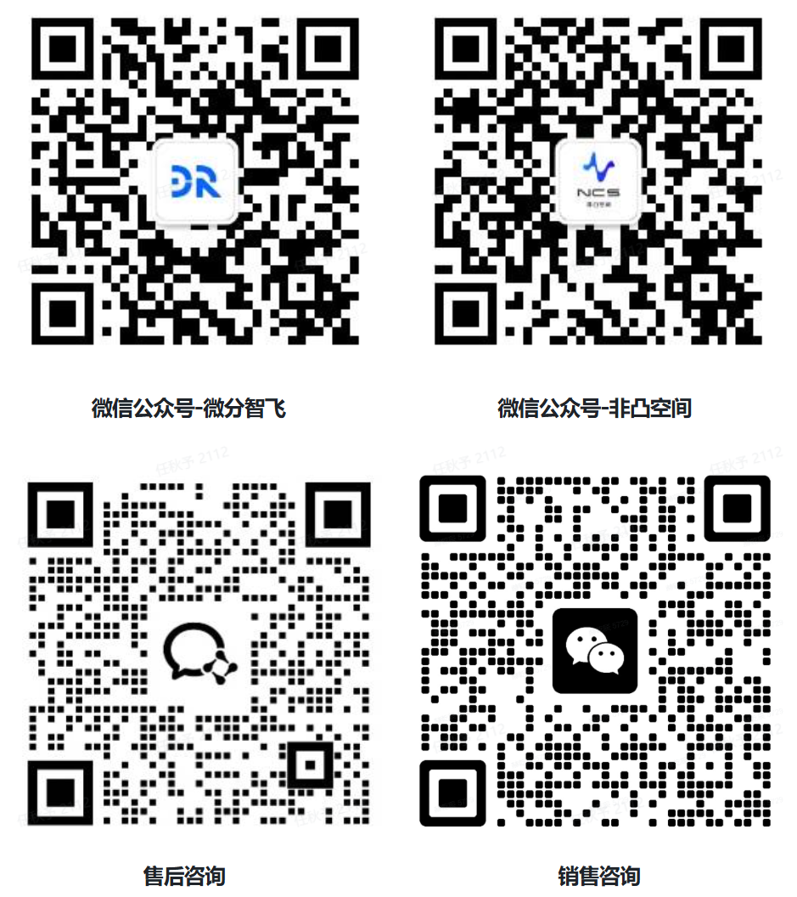

# 售后服务

!!! info "📖 本章导读"
    * 本章介绍保修政策、报修流程、联系方式与常用下载资源
    * 遇到无法自行解决的问题，可通过本章联系售后

## 售后服务条款

1. 凡购买非凸系列无人机的客户，可享受微分智飞专属售后服务。
2. 为用户提供产品出厂功能的使用咨询与技术答疑服务。
3. 产品使用中，因软件升级、配置调整引发的问题，我方将根据问题复杂程度，提供微信语音或视频远程指导。
4. 本政策仅适用于通过微分智飞官方授权渠道购买、并能提供有效购买凭证的产品；非正规渠道购买及转售产品，不在售后服务范围内；公司就通过非官方授权渠道购买的正品依相关法律法规的规定承担法定责任。
5. 产品整机保修期为 **12 个月**，保修期自产品交付之日起计算；无法确认交付日期的，以产品激活日期或出厂日期顺延 180 天起算；双方另有书面约定的，按约定执行。
6. 以下情形需由用户承担往返运费及维修费用（收费标准：人工费 + 配件成本费），具体收费标准可通过 www.diffrobot.com 查询。在提供维修服务前，将向用户告知预估费用，并获得用户的确认：
   - 因人为损坏、碰撞、进水、操作不当导致的故障；
   - 未经授权的私自改装、拆机、维修行为；
   - 超出 12 个月免费保修期的产品。
7. 保修期内，属于产品本身材质或制造工艺质量问题导致的故障，将进行免费维修，免收人工费、配件费及往返运费。

## 报修流程

1. **先自查**：遇到问题先查看[FAQ](../5-速查与排障/FAQ.md)和[异常处置](../5-速查与排障/异常处置.md)，多数问题可自行解决。
2. **联系售后**：通过下方联系方式联系售后，**描述问题时请附上以下信息**（能大幅加快排查速度）：
   - 产品型号与购买时间
   - 问题现象描述（何时出现、做了什么操作后出现）
   - 终端报错信息截图（如 mavros 输出、程序报错等）
   - 相关视频或照片（如有）
3. **远程协助**：售后会根据问题复杂程度提供微信语音或视频远程指导。
4. **返厂维修**：如需返厂，售后会告知寄送地址与寄送要求（请勿寄送电池等危险品），返厂前请自行备份机载电脑中的重要数据。

## 联系方式

## 常用下载

| 资源 | 说明 | 下载 |
| --- | --- | --- |
| RadioMaster T8L 遥控器 | 遥控器官网（产品介绍、固件升级） | [官网](https://www.rcgroups.com/forums/showthread.php?4842067RadioMaster-T8L-ExpressLRS-in-a-Compact-Screenless-Radico) |
| NoMachine 安装包 | Windows 版远程桌面工具 | [下载](https://diffrobots.oss-cn-hangzhou.aliyuncs.com/j30v2-wiki/materials/nomachine_9.1.24_6_x64.exe) |
| 非凸-α 飞控固件 | PX4 飞控固件 | [下载](https://diffrobots.oss-cn-hangzhou.aliyuncs.com/j30v2-wiki/materials/hkust_nxt-dual_default.px4) |
| 非凸-α 飞控参数 | 飞控参数文件 | [下载](https://diffrobots.oss-cn-hangzhou.aliyuncs.com/j30v2-wiki/materials/J30V2_1.0.0.params) |

> 💡 双目驱动、单目驱动等其他资料如仓库中没有对应资源，可联系售后获取。

---

**相关章节**：[FAQ](../5-速查与排障/FAQ.md) | [维护保养](维护保养.md) | [免责声明](免责声明.md)
